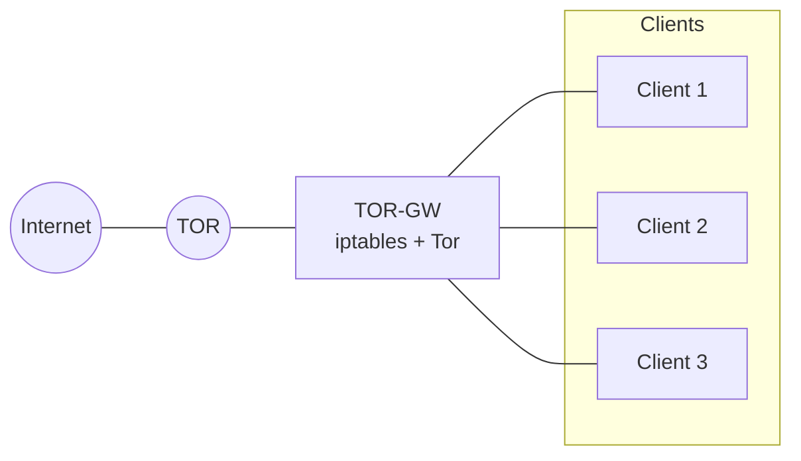

# tor-gw

A simple Linux **Tor Gateway** using **Tor + iptables**.

It turns a Linux machine into a gateway where client traffic is transparently redirected through Tor.



## Features

- Transparent client TCP traffic through Tor
- DNS traffic redirected through Tor
- NAT and firewall configuration
- **SSH port 22 remains open for gateway management**
- **The TOR-GW itself does not transparently route its own traffic through Tor**
- Automatic firewall backup
- Firewall rollback

## Usage

Clone the project:

```bash
git clone https://github.com/YOUR_USERNAME/tor-gw.git
cd tor-gw
chmod +x tor-gw.sh
```


Run setup:

```bash
sudo ./tor-gw.sh setup
```

The script detects the WAN and LAN interfaces and shows the configuration.

After confirmation, it configures Tor and applies the firewall.

Then configure the client to use the TOR-GW as its default gateway.

## Commands

```bash
./tor-gw.sh setup
./tor-gw.sh detect
./tor-gw.sh status
./tor-gw.sh rollback
```

`rollback` restores the firewall configuration that existed before `setup`.

## Files

Configuration and firewall backups are stored in:

```text
/etc/tor-gw/
```

---

If you want to rollback:

```bash
sudo ./tor-gw.sh rollback
```
## Example

```bash
vagrant@tor-gw-vm:~$ chmod +x ./tor-gw.sh
vagrant@tor-gw-vm:~$ sudo ./tor-gw.sh setup
[INFO] Checking dependencies
[ OK ] Dependencies OK
[INFO] Detecting network
[ OK ] WAN detected: eth0
[ OK ] LAN detected: eth1

==============================
 TOR-GW CONFIGURATION
==============================

WAN
 Interface : eth0
 IP        : 10.0.2.15
 Gateway   : 10.0.2.2

LAN
 Interface : eth1
 IP        : 192.168.56.127
 Network   : 192.168.56.0/24

Apply configuration? [Y/n]
[ OK ] Configuration saved
[INFO] Configuring Tor
[ OK ] Tor configuration updated
[ OK ] Firewall generated
[INFO] Testing firewall
[ OK ] Firewall valid
[INFO] Backing up current firewall
[INFO] Applying firewall
[ OK ] Firewall applied

==============================
 TOR-GW CLIENT SETUP
==============================

Example:

1. Show interfaces:
   ip -br a

   lo    UP  127.0.0.1/8 ...
   eth0  UP  10.0.2.15/24 ...
   eth1  UP  192.168.56.<1-254> ...

2. Set TOR-GW as default route:
   ip route replace default via 192.168.56.127 dev eth1

3. Verify:
   ip route

   default via 192.168.56.127 dev eth1

4. Test:
   ping -c 3 192.168.56.127
   curl https://check.torproject.org/api/ip


==============================
 This machine is now a TOR-GW

 To restore the previous firewall:
 ./tor-gw rollback:
==============================
```